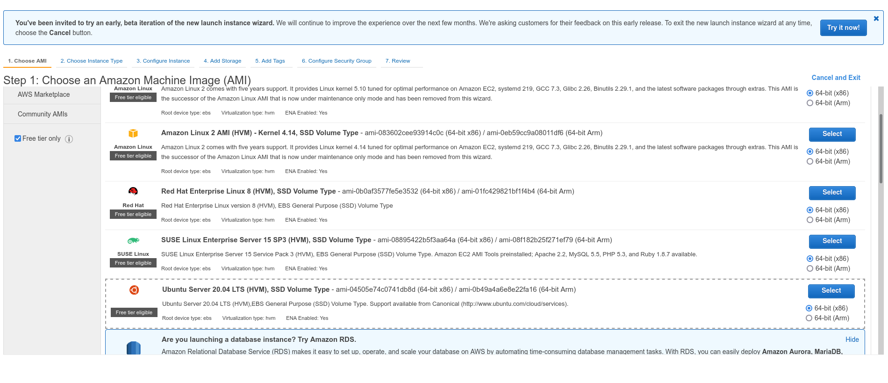
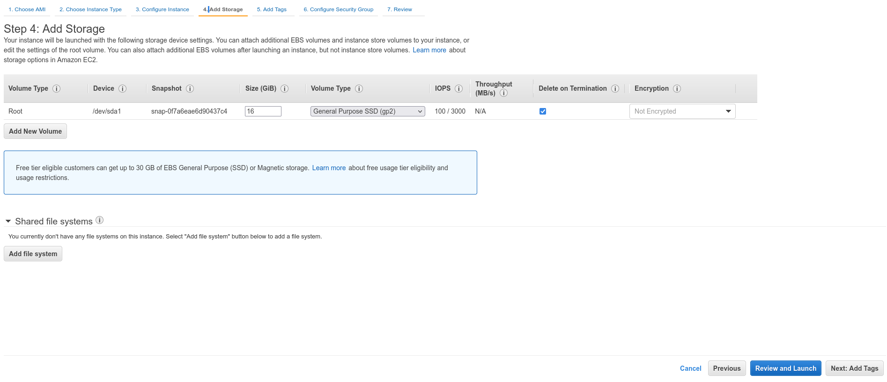
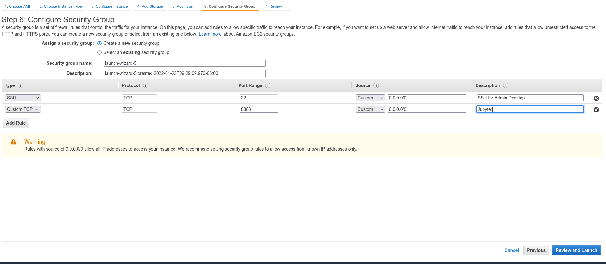

# Instructions to complete assignment 0

## Instance creation

- Use "Ubuntu Server 20.04 LTS" with type "t2.large", increase disk memory size to 16gb, and open port 8888 for jupyter








## Log into your instance

### Background information about SSH
Secure shell is a cryptographically secure mechanism of connecting over a network to a remote computer. The link https://www.ssh.com/academy/ssh provides a detailed overview of the protocol. The page https://missing.csail.mit.edu/2020/command-line/ provides a good overview of command line. The section in the missing semester page on Remote Machines introduces some ssh recipes. Please pay special attention to these as this will be very important in the class.

Here are a few video links that provide specific information on working with ssh and EC2 instances.

* For Windows user: https://www.youtube.com/watch?v=bi7ow5NGC-U
* For Mac and Linux users: https://www.youtube.com/watch?v=Nv_1u8gCkIQ

### Assignment specifics for SSH
- ssh into your instance where "..." is your instances public ip

```
ssh -i .ssh/insertYourKey.pem ubuntu@...
```

- If on linux/mac (if you are on windows and use putty, please consult the internet), if you get the following error when attempting to ssh in...
- where "..." is your instances public ip

```sh
@@@@@@@@@@@@@@@@@@@@@@@@@@@@@@@@@@@@@@@@@@@@@@@@@@@@@@@@@@@
@         WARNING: UNPROTECTED PRIVATE KEY FILE!          @
@@@@@@@@@@@@@@@@@@@@@@@@@@@@@@@@@@@@@@@@@@@@@@@@@@@@@@@@@@@
Permissions 0644 for '.ssh/insertYourKey.pem' are too open.
It is required that your private key files are NOT accessible by others.
This private key will be ignored.
Load key ".ssh/insertYourKey.pem": bad permissions
ubuntu@...: Permission denied (publickey).
```

then you should run the command:

```sh
chmod 600 .ssh/insertYourKey.pem
```

and try again


## set up instance
- add 16gb of swap space to the instance following the instructions [here](https://www.howtogeek.com/455981/how-to-create-a-swap-file-on-linux/)

```sh
sudo apt-get update
sudo apt install -y python3-pip python3.8-venv
python3 -m venv big_data_env
source big_data_env/bin/activate
pip install pandas pyarrow tqdm jupyter_http_over_ws
jupyter serverextension enable --py jupyter_http_over_ws
sudo dd if=/dev/zero of=/swapfile bs=1G count=10
sudo mkswap /swapfile
sudo chmod 600 /swapfile
sudo swapon /swapfile
sudo bash -c 'echo "/swapfile none swap sw 0 0" >> /etc/fstab'
```

## port forwarding (unix instructions)
- [background wikipedia info](https://en.wikipedia.org/wiki/Port_forwarding)
- [port forwarding ultimate guide](https://phoenixnap.com/kb/ssh-port-forwarding)
- command to port forward on linux shown below where "..." is your instances public ip

```sh
ssh -i ~/.ssh/yourKey.pem -L 8888:127.0.0.1:8888 ubuntu@0...
```

**Note** If you use windows as your host environment, please use putty and [follow these instructions to convert the .pem (the private key)](https://aws.amazon.com/premiumsupport/knowledge-center/ec2-ppk-pem-conversion/) into ppk format that can be used with putty. Use [these instructions to setup port forwarding on putty](http://sysnews.ma.ic.ac.uk/ssh/port-forwarding-for-Windows-using-PuTTY.html) Note the source port is 8888 and destionation is 127.0.0.1:8888.  

- follow instructions [here](https://research.google.com/colaboratory/local-runtimes.html) to connect colab to your notebook instance (commands to do so are below)

```
jupyter notebook \
  --NotebookApp.allow_origin='https://colab.research.google.com' \
  --port=8888 \
  --NotebookApp.port_retries=0
```

- connect with colab and run your code
